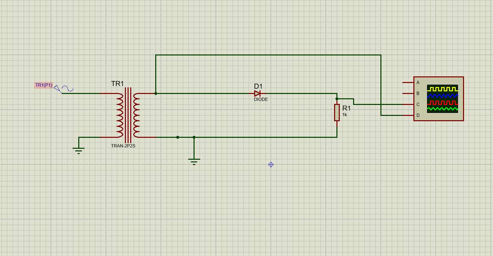

# Half Wave Rectifier using Proteus

## Objective
To design and simulate a Half Wave Rectifier that converts AC input into pulsating DC output.

---

## Components Used
- AC Voltage Source(230V,50Hz)
- Transformer
- Diode 
- Load Resistor
- Oscilloscope
- Ground

---

## Software Used
Proteus 8 Professional

---

## Circuit Diagram

---

## Output Waveform

---

## Working Principle
A half wave rectifier uses a diode to allow only the positive half cycle of the AC input signal. The negative half cycle is blocked by the diode, producing a pulsating DC output across the load resistor.

---

## Project Files
- Half Wave rectifier .pdsprj
- Circuit_Diagram_HFW.png
- Output_Waveform_HFW.png
